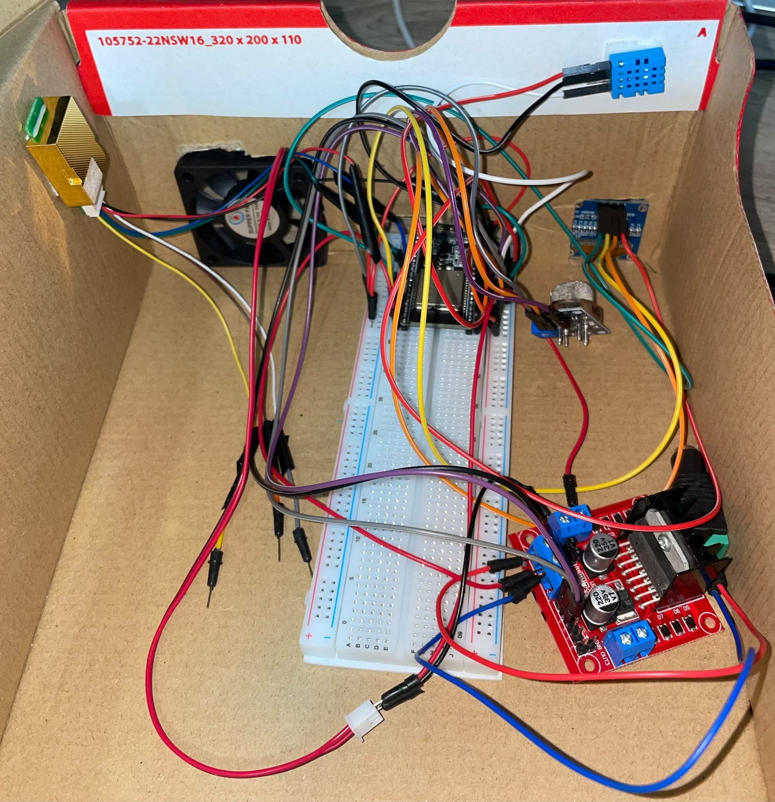
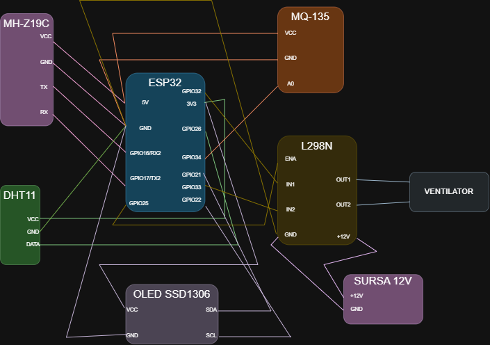
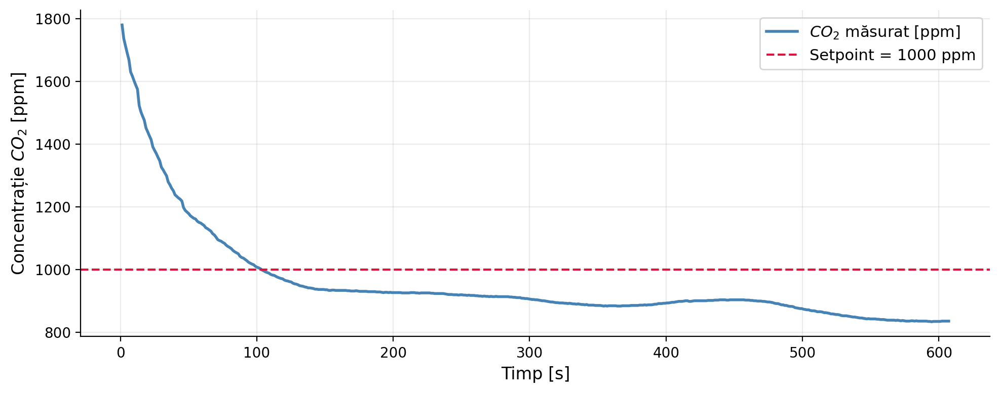
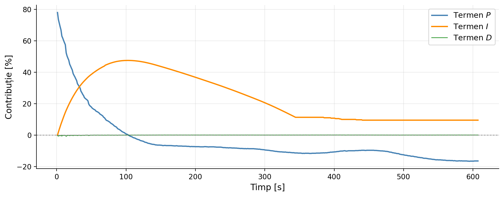

# Smart Air Quality Ventilation System

An ESP32-based smart ventilation system that monitors indoor air quality and automatically adjusts fan speed using a PID controller.

The system was developed as part of my bachelor's thesis. Its purpose is to maintain the CO2 concentration around a reference value of 1000 ppm by continuously adjusting the ventilation level.

## Features

- Real-time CO2 monitoring using the MH-Z19C sensor
- Temperature and humidity measurement using the DHT11 sensor
- Additional air quality monitoring using the MQ-135 sensor
- PID-based fan speed control
- Anti-windup protection for the integral term
- Fan dead-zone compensation
- PWM fan control through the L298N driver
- Real-time data display on an SSD1306 OLED
- CSV data logging through the Serial interface

## Hardware Components

- ESP32 development board
- MH-Z19C CO2 sensor
- DHT11 temperature and humidity sensor
- MQ-135 air quality sensor
- SSD1306 OLED display
- L298N motor driver
- 12 V DC fan
- External 12 V power supply

## Hardware Setup



## System Overview

The MH-Z19C sensor measures the CO2 concentration inside the test enclosure and sends the value to the ESP32 through UART communication.

The ESP32 calculates the control error as the difference between the measured CO2 concentration and the 1000 ppm setpoint. The PID controller then determines the required fan command.

The resulting command is converted into a PWM signal and applied to the fan through the L298N motor driver.

When the CO2 concentration rises above the setpoint, the fan speed increases. As the concentration approaches the reference value, the fan speed gradually decreases.

## PID Controller

The controller uses the following parameters:

```cpp
Kp = 0.10
Ki = 0.002
Kd = 0.02
```

The initial controller parameters were calculated using the Internal Model Control method and were later adjusted experimentally on the physical setup.

The controller also includes:

- conditional integration
- integral clamping between 0 and 60
- output saturation between 0% and 100%
- fan dead-zone compensation

## Fan Dead-Zone Compensation

During testing, the fan did not start reliably for PWM commands below approximately 24%.

To compensate for this behavior, every non-zero PID command is remapped from the logical range of 0-100% to the physical PWM range of 24-100%.

This ensures that the fan receives enough power to start whenever ventilation is required.

## Pin Configuration

| Component | ESP32 Pin |
|---|---:|
| OLED SDA | GPIO 21 |
| OLED SCL | GPIO 22 |
| DHT11 data | GPIO 26 |
| MQ-135 analog output | GPIO 34 |
| MH-Z19C RX | GPIO 16 |
| MH-Z19C TX | GPIO 17 |
| L298N ENA | GPIO 25 |
| L298N IN1 | GPIO 32 |
| L298N IN2 | GPIO 33 |

## Wiring Diagram



## Required Libraries

The following Arduino libraries are required:

- Adafruit GFX Library
- Adafruit SSD1306
- DHT sensor library
- Wire
- HardwareSerial

The Adafruit and DHT libraries can be installed using the Arduino IDE Library Manager. `Wire` and `HardwareSerial` are included with the ESP32 Arduino core.

## Arduino Setup

1. Install the ESP32 board package in Arduino IDE.
2. Select the appropriate ESP32 development board.
3. Install the required libraries.
4. Open `smart_air_quality_ventilation.ino`.
5. Connect the ESP32 board.
6. Select the correct COM port.
7. Compile and upload the sketch.

The code uses the ESP32 LEDC PWM API available in Arduino-ESP32 Core 3.x.

## Serial Output

The system sends experimental data in CSV format:

```text
time_ms,co2_ppm,setpoint_ppm,fan_percent,p_term,i_term,d_term,temp_c,hum_pct,airq_raw
```

The logged data can be saved and later used for plotting and performance analysis.

## Experimental Setup

The system was tested inside a small enclosure with an approximate volume of 0.008 m³.

A reduced test volume was used to observe changes in CO2 concentration over a shorter period and to validate the controller under controlled conditions.

The identified first-order process model had the following approximate parameters:

```text
Time constant: 33.6 s
Static gain: -5.96 ppm/%
```

## Results

Experimental tests showed that the system was able to reduce the CO2 concentration from approximately 1500-1800 ppm toward the 1000 ppm setpoint.

The controller produced a stable response without significant oscillations and gradually reduced the fan command as the CO2 concentration approached the reference value.

### CO2 Response



### PID Terms



## Limitations

- The system was tested in a small experimental enclosure.
- The fan is controlled without direct RPM feedback.
- The MH-Z19C sensor may introduce measurement noise.
- The derivative term is not filtered.
- The current implementation does not include remote monitoring or IoT communication.

## Future Improvements

Possible future developments include:

- testing the system in a real room
- adding Wi-Fi and IoT monitoring
- creating a web dashboard
- implementing automatic PID tuning
- filtering the derivative term
- adding fan speed feedback
- estimating the internal CO2 generation rate

## Author

Valentina-Ana-Maria Alexandru

Bachelor's thesis project developed at the **Faculty of Automatic Control and Computer Science**,  
**National University of Science and Technology POLITEHNICA Bucharest**.
